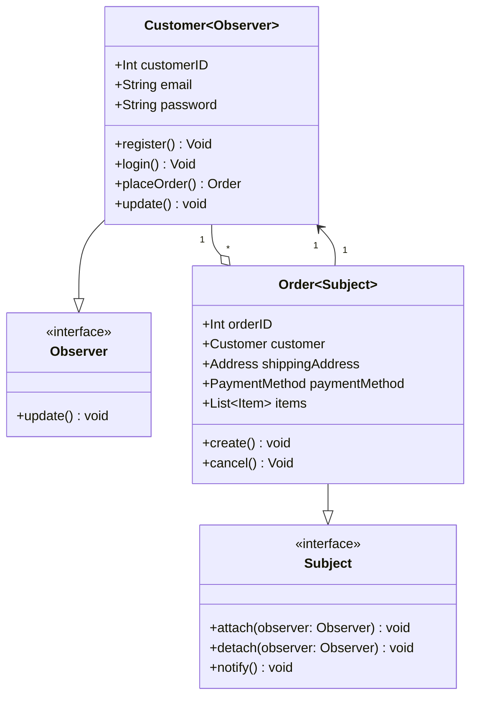
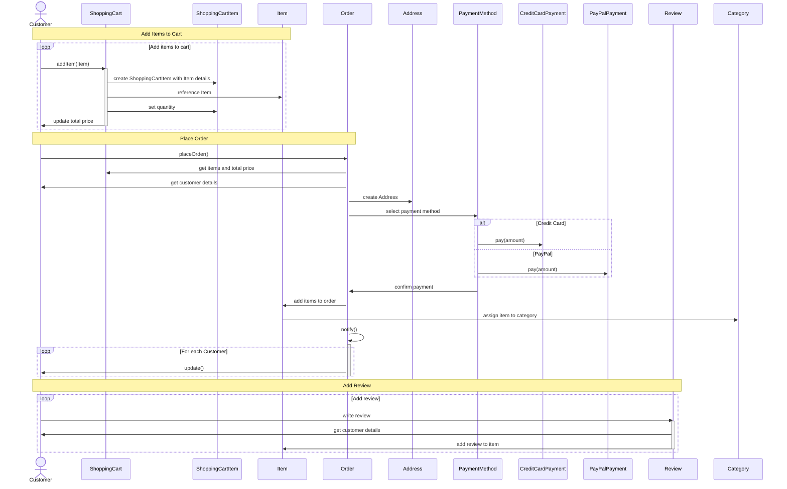
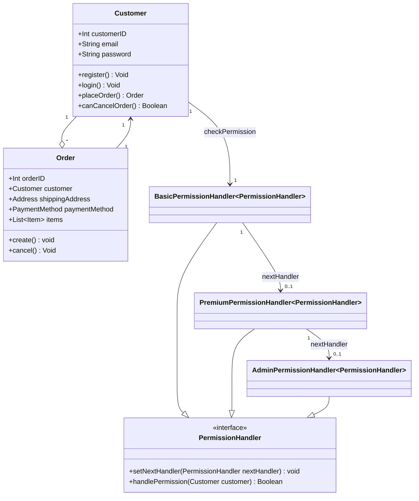
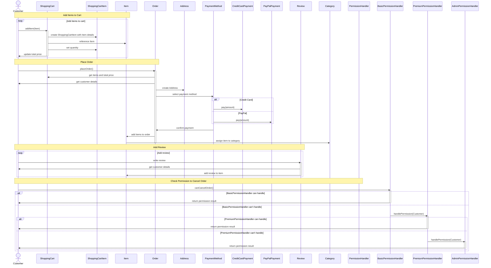

# Behavioral Patterns

## Observer

Wzorzec observer może być użyteczny w naszym diagramie klas w kontekście relacji między klasami `Customer` i `Order`. 
Gdy klient składa zamówienie, może chcieć być powiadamiany o zmianach w statusie tego zamówienia (np. gdy zamówienie jest wysyłane, opóźnione lub anulowane). 
Implementacja wzorca obserwatora pozwala na utrzymanie spójności informacji między klientem a jego zamówieniami, jednocześnie unikając sztywnego powiązania między tymi klasami.

W tym przypadku klasa `Order` (**subject**) reprezentuje obiekt powiadamiający, który przechowuje informacje o stanie zamówienia, a klasa `Customer` (**observer**) reprezentuje obiekt obserwujący, który jest zainteresowany otrzymywaniem informacji o zmianach stanu zamówienia.

Zastosowanie wzorca observer w tym diagramie ma następujące zalety:
1. **Oddzielenie klientów od zamówień**: 
Implementacja wzorca observer pozwala na oddzielenie logiki klientów od logiki zamówień. 
Dzięki temu można modyfikować jedną stronę zależności (np. wprowadzać zmiany w klasie `Order`), nie wpływając na drugą stronę (klasę `Customer`).
2. **Dynamiczne powiadamianie o zmianach**: 
Wzorzec **observer** umożliwia automatyczne powiadamianie klientów o zmianach w ich zamówieniach, bez konieczności sprawdzania tych zmian w sposób aktywny. 
Klient zostanie powiadomiony natychmiast po wystąpieniu zmiany stanu zamówienia.
3. **Skalowalność**: 
Wzorzec **observer** pozwala na łatwe dodawanie nowych klientów i zamówień, bez konieczności modyfikacji istniejącego kodu. 
Nowe obiekty klientów mogą być łatwo zarejestrowane jako obserwatorzy dla istniejących lub nowych zamówień.
4. **Elastyczność**: 
Dzięki wzorcowi **observer** istnieje możliwość dodawania nowych funkcjonalności, które również będą wykorzystywać mechanizm powiadamiania o zmianach w zamówieniach. 
Na przykład, można dodać funkcję przesyłania e-maili z powiadomieniami lub inne kanały komunikacji bez konieczności modyfikacji istniejących klas `Customer` i `Order`.

Podsumowując, zastosowanie wzorca observer w diagramie klas związanych z klientami i zamówieniami pozwala na utrzymanie spójności informacji, jednocześnie unikając sztywnych powiązań między klasami. Daje to większą elastyczność i łatwość w rozbudowie i modyfikacji systemu.

### Class diagram

W powyższym diagramie sekwencji, dodajemy powiadomienie obserwatorów (klientów) poprzez wywołanie metody "notify()" w klasie `Order`. 
Następnie, dla każdego klienta, wywołuję metodę "update()" w celu poinformowania ich o zmianach w zamówieniu.

### Sequence diagram

## Chain of Responsibility

Wzorzec Chain of Responsibility (łańcuch odpowiedzialności) może być użyty w naszym diagramie klas, aby zdecentralizować logikę obsługi uprawnień związanych z anulowaniem zamówienia przez klienta. 
Zamiast umieszczać całą logikę sprawdzania uprawnień w jednej klasie, ten wzorzec pozwala na utworzenie łańcucha obiektów obsługujących uprawnienia. 
Każdy obiekt w łańcuchu odpowiada za sprawdzenie uprawnień na swoim poziomie i przekazanie sprawdzenia dalej, jeśli nie jest w stanie udzielić odpowiedniej decyzji.

W naszym diagramie klas, klient może mieć różne poziomy uprawnień, 
np. podstawowe, premium i admin. W związku z tym, możemy utworzyć trzy różne klasy obsługujące te poziomy uprawnień: `BasicPermissionHandler`, `PremiumPermissionHandler` i `AdminPermissionHandler`. 
Każda z tych klas implementuje interfejs `PermissionHandler`, który definiuje wspólne metody do ustawienia następnego obiektu w łańcuchu (`setNextHandler`) i obsługi uprawnień (`handlePermission`).

W przypadku anulowania zamówienia przez klienta, łańcuch odpowiedzialności rozpoczyna się od `BasicPermissionHandler`, 
który sprawdza, czy klient ma podstawowe uprawnienia do anulowania zamówienia. Jeśli nie jest w stanie udzielić odpowiedniej decyzji, 
przekazuje sprawdzenie dalej do `PremiumPermissionHandler`, który z kolei sprawdza uprawnienia na poziomie premium. Jeśli również nie jest w stanie udzielić odpowiedniej decyzji, przekazuje sprawdzenie do `AdminPermissionHandler`, 
który sprawdza uprawnienia na poziomie administratora. Proces ten kontynuowany jest, aż jeden z obiektów obsługujących uprawnienia podejmie decyzję lub do momentu, gdy cały łańcuch zostanie sprawdzony.

Korzystając z tego wzorca w naszym diagramie klas, możemy łatwo rozszerzać i modyfikować logikę sprawdzania uprawnień bez ingerowania w inne klasy, takie jak `Customer` czy `Order`. 
Wzorzec ten wprowadza elastyczność i łatwość zarządzania, gdy potrzebujemy wprowadzić zmiany w systemie uprawnień.

### Class diagram

### Sequence diagram

