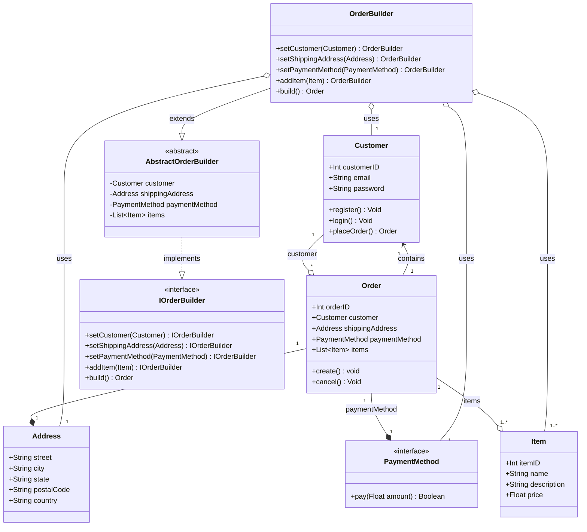
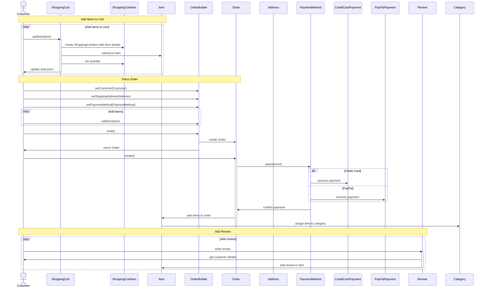
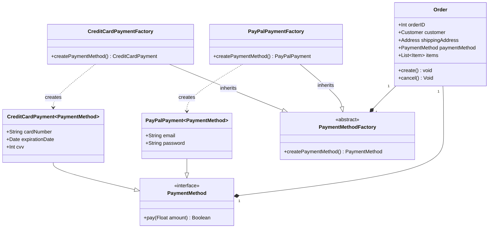
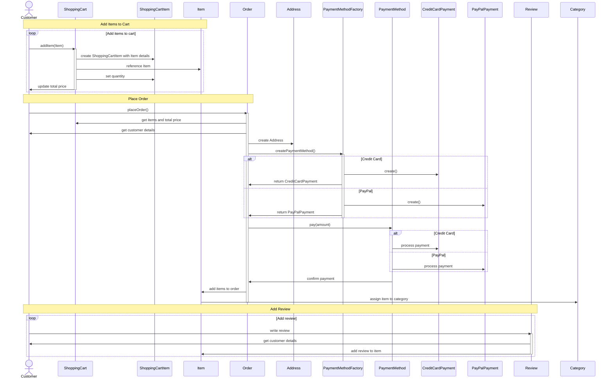

# Creational Patterns

## Builder pattern

W tym diagramie warto użyć wzorca **Budowniczy** (_Builder_) ze względu na złożoność obiektów, takich jak `Order`, które mają wiele atrybutów i zależności.
Wzorzec **Builder** może pomóc w uporządkowaniu procesu tworzenia obiektów `Order` poprzez zapewnienie bardziej elastycznego i czytelnego podejścia do
konstrukcji tych obiektów.

Oto kilka powodów, dla których warto użyć wzorca Builder w tym przypadku:
1. Łatwiejsza konstrukcja obiektów: **Budowniczy** pozwala na tworzenie obiektów krok po kroku, umożliwiając konstrukcję obiektów z różnymi kombinacjami atrybutów i zależnościami.
   Dzięki temu można uniknąć zbyt skomplikowanych konstruktorów lub wielu konstruktorów z różnymi argumentami.
2. Oddzielenie logiki konstrukcji od reprezentacji: Wzorzec **Builder** oddziela proces tworzenia obiektów od ich reprezentacji.
   Umożliwia to utrzymanie kodu bardziej przejrzystym i modularnym, ułatwiając jednocześnie utrzymanie i rozwój.
3. Łatwiejsza modyfikacja i rozbudowa: Jeśli chcemy dodać nowy atrybut lub zależność do klasy Order, wystarczy zmodyfikować odpowiednią metodę w Builderze, zamiast modyfikować wiele konstruktorów. Dzięki temu modyfikacje są łatwiejsze do zarządzania, a kod jest bardziej elastyczny.
4. Niezmienność obiektów: Wzorzec Builder może pomóc w utrzymaniu niezmienności obiektów, co jest szczególnie ważne w przypadku klas, które mają wiele atrybutów. Niezmienne obiekty są bezpieczniejsze i łatwiejsze w utrzymaniu, ponieważ ich stan nie może być zmieniony po utworzeniu.

W kontekście tego diagramu, warto zastosować wzorzec **Builder** w klasie `Order`, która ma wiele zależności, takich jak `Customer`, `Address`, `PaymentMethod` i `Item`.
Implementacja Builder'a w klasie Order pozwoli na elastyczne tworzenie zamówień z różnymi kombinacjami atrybutów, jednocześnie utrzymując kod czytelnym i łatwym w utrzymaniu.

### Class diagram

> Wyłącznie modyfikowana część (nie cały diagram)

### Sequence diagram

Na tym diagramie sekwencji przedstawiono proces zakupu w systemie sklepu internetowego. Diagram ilustruje następujące etapy:
1. Dodawanie przedmiotów do koszyka
    - Klient (`Customer`) dodaje przedmioty (`Item`) do koszyka (`ShoppingCart`).
    - Koszyk tworzy obiekt `ShoppingCartItem` z informacjami o dodanym przedmiocie oraz jego ilości.
    - Koszyk aktualizuje łączną cenę i przekazuje ją do klienta.
2. Składanie zamówienia:
    - Klient korzysta z `OrderBuilder` (`OBuilder`) do ustawienia informacji o sobie, adresie wysyłki oraz metodzie płatności.
    - W pętli, klient dodaje wszystkie przedmioty z koszyka do OrderBuilder.
    - Następnie klient wywołuje metodę `build()` na `OBuilder`, który tworzy nowe zamówienie (`Order`) i zwraca je do klienta.
    - Klient wywołuje metodę create() na obiekcie `Order`, który następnie korzysta z metody `pay()` na wybranej metodzie płatności (`PaymentMethod`).
    - Diagram pokazuje dwie możliwe metody płatności: kartą kredytową (`CreditCardPayment`) lub PayPal (`PayPalPayment`).
    - Po potwierdzeniu płatności, przedmioty są dodawane do zamówienia, a także przypisywane do odpowiednich kategorii (`Category`).
3. Dodawanie recenzji:
    - W pętli, klient dodaje recenzje (`Review`) do przedmiotów.
    - Recenzja zawiera informacje o kliencie, treść oraz ocenę
    - Recenzja jest dodawana do odpowiedniego przedmiotu (`Item`)

Diagram sekwencji ilustruje interakcje pomiędzy klientem, koszykiem, zamówieniem, przedmiotami, metodami płatności, recenzjami oraz kategoriami w trakcie całego procesu zakupu w sklepie internetowym.

## Abstract Factory Pattern
Wzorzec **Fabryki Abstrakcyjnej** warto zastosować w tym przypadku, ze względu na obecność różnych typów płatności: `CreditCardPayment` oraz `PayPalPayment`.
Wzorzec ten pozwala na odseparowanie tworzenia obiektów płatności od głównych klas, takich jak `Customer` czy `Order`.

Główne zalety użycia wzorca **Fabryki Abstrakcyjnej** w tym kontekście to:

1. **Łatwe rozszerzanie**:
   Jeśli pojawią się nowe metody płatności, wystarczy dodać nową klasę fabryki, która będzie implementować interfejs `PaymentMethodFactory`. Nie będzie konieczne modyfikowanie istniejącego kodu, co zwiększa elastyczność systemu i ułatwia jego rozwijanie.
2. **Oddzielenie logiki tworzenia obiektów**
   Wzorzec **Fabryki Abstrakcyjnej** pozwala na przeniesienie logiki tworzenia obiektów płatności do dedykowanych klas fabryk. Dzięki temu klasa `Order` może skupić się na swojej głównej funkcji, czyli zarządzaniu zamówieniem, a nie na tworzeniu obiektów płatności.
3. **Ułatwione testowanie**
   Dzięki temu, że tworzenie obiektów płatności jest odseparowane od pozostałych klas, łatwiej będzie napisać testy jednostkowe sprawdzające różne metody płatności. Można wtedy łatwo podmienić konkretne implementacje fabryk na ich testowe wersje (np. z użyciem mocków), co pozwala na kontrolowanie zachowań w trakcie testowania.
4. **Łatwość konfiguracji**
   Wykorzystując wzorzec Fabryki Abstrakcyjnej, łatwo można zmienić metodę płatności używaną przez system, podmieniając tylko odpowiednią klasę fabryki. Dzięki temu system staje się bardziej elastyczny i łatwy w konfiguracji.

### Class diagram

### Sequence diagram

