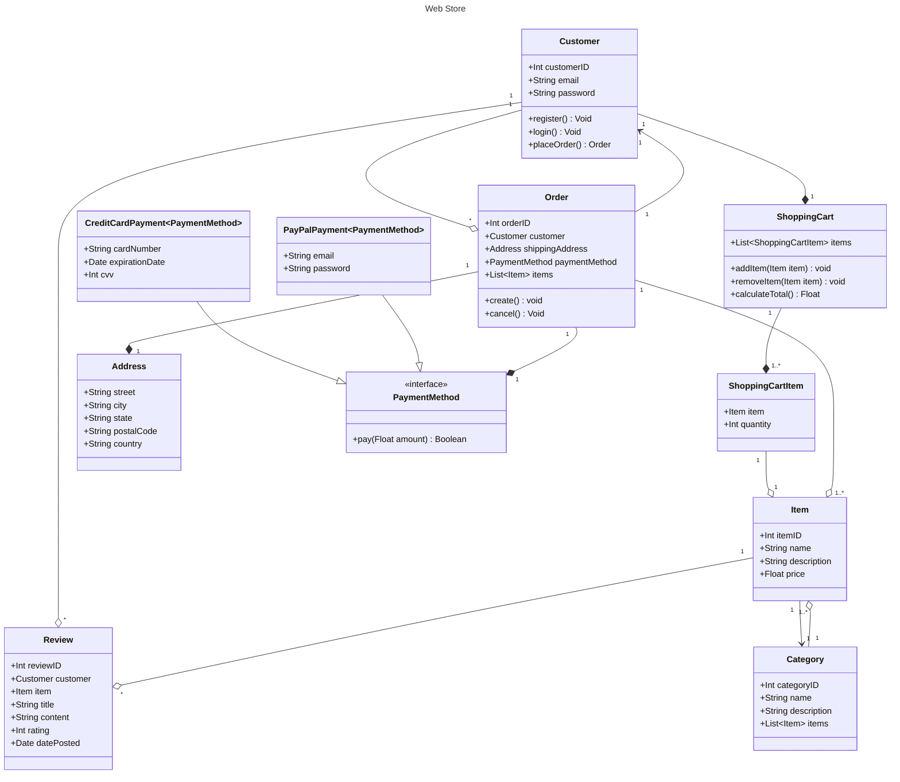
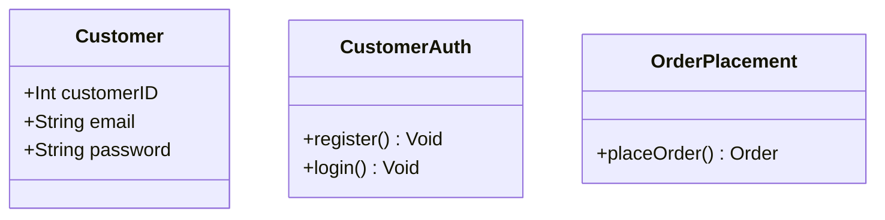
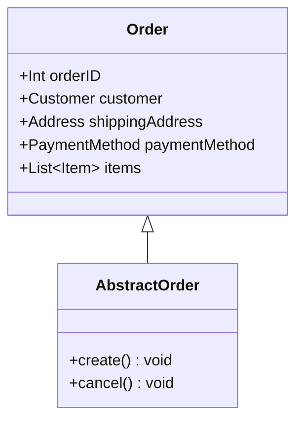
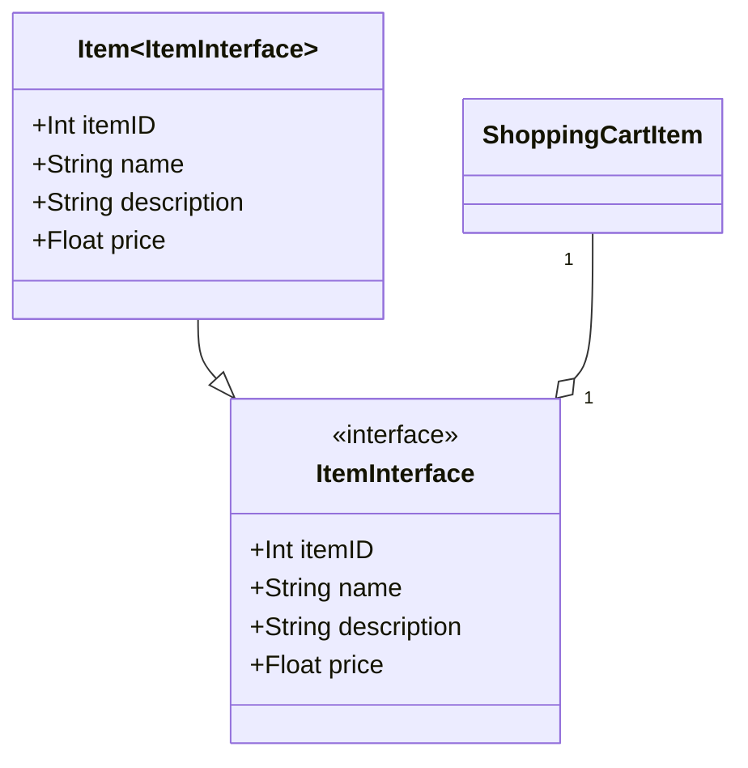

# SOLID

Solid - zasady projektowania oprogramowania, które zdobyły uznanie na całym świecie, zostały zaproponowane przez Roberta C. Martina (znanego również jako "Uncle Bob") na początku lat 2000. Od tamtej pory solid stały się niezwykle ważne w dziedzinie inżynierii oprogramowania, gdyż pozwalają tworzyć oprogramowanie o większej elastyczności, łatwiejszym do utrzymania i rozbudowy.

Pomimo upływu lat, solid nadal są aktualne, ponieważ stanowią istotne filary tworzenia oprogramowania. Wprowadzenie tych zasad do praktyki programistycznej przyczynia się do rozwoju skalowalnych, modularnych i elastycznych systemów.

Solid składa się z pięciu zasad, które obejmują:

1. Single Responsibility Principle (SRP) - zasada pojedynczej odpowiedzialności,
2. Open/Closed Principle (OCP) - zasada otwarte-zamknięte,
3. Liskov Substitution Principle (LSP) - zasada podstawienia Liskov,
4. Interface Segregation Principle (ISP) - zasada segregacji interfejsów,
5. Dependency Inversion Principle (DIP) - zasada inwersji zależności.

Wprowadzenie solid do projektowania oprogramowania pozwala na unikanie częstych problemów, takich jak: skomplikowana struktura kodu, trudności w modyfikowaniu istniejącego oprogramowania czy powolne tempo rozwoju. Stosowanie solid pomaga programistom w tworzeniu kodu bardziej zrozumiałego, co przekłada się na łatwiejszą współpracę w zespołach oraz efektywniejsze zarządzanie projektem. Dzięki temu, solid pozostają niezwykle aktualne, niezależnie od zmieniających się trendów i technologii.

### Początkowy diagram klas

## Single Responsibility Principle (SRP)

Zasada pojedynczej odpowiedzialności (Single Responsibility Principle, SRP) stanowi, że każda klasa w programie powinna mieć tylko jedną odpowiedzialność, czyli jeden powód do zmiany. Innymi słowy, SRP mówi, że klasa powinna zajmować się tylko jednym aspektem funkcjonalności i nie być obarczona dodatkowymi zadaniami. Zastosowanie tej zasady prowadzi do modularności, co ułatwia zarządzanie, rozwój i utrzymanie oprogramowania.

SRP jest istotna, ponieważ pozwala uniknąć problemów związanych z wysokim sprzężeniem między komponentami. Wprowadzenie tej zasady sprawia, że każda klasa staje się bardziej niezależna i łatwiejsza do zrozumienia, testowania oraz modyfikowania. Ponadto, SRP przyczynia się do poprawy czytelności kodu, ponieważ każda klasa skupia się na pojedynczym zadaniu.

### Implementacja w naszym diagramie

W tym diagramie klas zasada Single Responsibility (SRP) jest stosowana w większości przypadków. Większość klas skupia się na jednym aspekcie systemu i ma tylko jedną odpowiedzialność. Jednakże klasa "Customer" może zostać poprawiona, aby lepiej stosować się do zasady SRP.

Klasa "Customer" zarządza nie tylko danymi klienta, ale także logowaniem, rejestracją i składaniem zamówień. Możemy poprawić stosowanie SRP, rozdzielając te funkcjonalności na kilka klas.

W wyniku podziału klasy `Customer`, otrzymujemy trzy klasy, każda z jedną odpowiedzialnością. Klasa `Customer` przechowuje teraz tylko dane klienta, klasa `CustomerAuth` zarządza procesem logowania i rejestracji, a klasa `OrderPlacement` umożliwia składanie zamówień. Dzięki temu, większość klas w diagramie stosuje się do zasady SRP.

## Open/Closed Principle (OCP)

Zasada otwarte-zamknięte (Open/Closed Principle, OCP) stanowi, że klasy, moduły i funkcje powinny być otwarte na rozszerzenia, ale zamknięte na modyfikacje. Oznacza to, że istniejące elementy oprogramowania powinny być tak zaprojektowane, aby można było dodawać nowe funkcjonalności bez konieczności modyfikowania ich istniejącego kodu. OCP osiąga się poprzez użycie abstrakcji, interfejsów i dziedziczenia.

OCP jest istotne, ponieważ pozwala na rozwój oprogramowania bez wprowadzania zmian w istniejącym kodzie. Dzięki temu unika się ryzyka wprowadzenia błędów czy negatywnego wpływu na inne części systemu. Stosowanie OCP pozwala tworzyć systemy bardziej modularne, łatwiejsze do rozbudowy i utrzymania.

Stosowanie OCP:

Głównym podejściem do zastosowania OCP jest użycie abstrakcji i interfejsów. Wprowadzenie interfejsów pozwala na definiowanie zachowań, które mogą być implementowane przez różne klasy, bez konieczności modyfikacji istniejącego kodu.

### Implementacja w naszym diagramie

W diagramie klas, zasada Open/Closed Principle (OCP) jest w dużej mierze przestrzegana, szczególnie w przypadku klas związanych z metodami płatności (PaymentMethod, CreditCardPayment, PayPalPayment). Interfejs PaymentMethod pozwala na dodawanie nowych metod płatności bez modyfikowania istniejących klas.

Jednakże, warto zwrócić uwagę na klasę Customer, która obsługuje rejestrację, logowanie i składanie zamówień. W poprzedniej odpowiedzi przedstawiliśmy sposób podziału klasy Customer, aby lepiej przestrzegać zasadę Single Responsibility. Wprowadzenie takiego podziału również przyczyni się do zastosowania zasady OCP.

Możemy również zastosować OCP w przypadku klasy "Order". Przyjmijmy, że w przyszłości będziemy mieć różne rodzaje zamówień, które będą miały inne sposoby tworzenia i anulowania. Aby zastosować OCP, wprowadzamy abstrakcyjną klasę bazową "AbstractOrder" lub interfejs, który definiuje metody create() i cancel():

Teraz klasa "Order" dziedziczy po klasie "AbstractOrder":

Dzięki zastosowaniu OCP, możemy łatwo wprowadzać nowe rodzaje zamówień, tworząc nowe klasy, które dziedziczą po "AbstractOrder" lub implementują interfejs "Order", bez konieczności modyfikacji istniejących klas.

## Liskov Substitution Principle (LSP)

Zasada podstawienia Liskov (Liskov Substitution Principle, LSP) została sformułowana przez Barbarę Liskov w 1987 roku. LSP mówi, że obiekty typu klasy bazowej powinny być w stanie być zastąpione obiektami klasy pochodnej bez wpływu na poprawność programu. Innymi słowy, jeśli klasa S dziedziczy po klasie T, to obiekt typu T może być zastąpiony obiektem typu S, bez wprowadzania żadnych niezgodności.

LSP jest istotna z kilku powodów:

1. Poprawa modularności: Dzięki LSP, programy stają się bardziej modularne i elastyczne, co sprawia, że są łatwiejsze w rozbudowie i utrzymaniu.
2. Zachowanie kontraktu: Zastosowanie LSP zapewnia, że klasy pochodne będą przestrzegać kontraktu zdefiniowanego przez klasę bazową. Dzięki temu, programy są bardziej stabilne, gdyż nie powodują nieoczekiwanych błędów wynikających z niezgodności między klasami bazowymi i pochodnymi.
3. Łatwiejsze testowanie: Programy przestrzegające LSP są łatwiejsze do testowania, gdyż można zastosować te same testy dla klas bazowych i pochodnych.
4. Reużywalność kodu: LSP pozwala na większą reużywalność kodu, gdyż klasy pochodne mogą być używane w miejscach, gdzie używane są klasy bazowe, bez konieczności modyfikacji istniejącego kodu.

Aby przestrzegać zasady LSP, należy zwrócić uwagę na następujące aspekty:

1. Inwarianty klasy bazowej: Klasy pochodne powinny utrzymywać inwarianty klasy bazowej. Oznacza to, że warunki, które zawsze są prawdziwe dla klasy bazowej, muszą być również prawdziwe dla klasy pochodnej.
2. Sygnatury metod: Klasy pochodne powinny być zgodne z sygnaturami metod klasy bazowej. Obejmuje to zgodność typów argumentów, typów zwracanych oraz wyjątków zgłaszanych przez metody.
3. Semantyka: Klasy pochodne nie powinny zmieniać semantyki metod klasy bazowej. Oznacza to, że klasy pochodne powinny spełniać oczekiwania dotyczące zachowań zdefiniowanych przez klasę bazową.

### Implementacja w naszym diagramie

Nasz diagram klas przestrzega zasady Liskov Substitution Principle, ponieważ klasy pochodne są zgodne z klasami bazowymi. Przykładem tego jest stosowanie interfejsu PaymentMethod przez klasy CreditCardPayment i PayPalPayment, które implementują metodę `pay(Float amount)`.

Ponadto, nie ma żadnych klas pochodnych, które zmieniają semantykę metod klasy bazowej. Warto zauważyć, że większość klas w diagramie nie ma klas pochodnych, więc LSP jest stosowany głównie w kontekście interfejsu PaymentMethod i jego implementacji.

Nie ma więc konieczności dodatkowego stosowania LSP w tym przypadku.

## Interface Segregation Principle (ISP)

Zasada segregacji interfejsów mówi, że klient (klasa korzystająca z interfejsu) nie powinien być zmuszony do implementowania metod, których nie używa.
Zamiast tego, interfejsy powinny być rozdzielone na mniejsze, bardziej spójne i wyspecjalizowane, tak aby klient mógł implementować tylko te metody, których rzeczywiście potrzebuje.

ISP jest istotna z następujących powodów:

1. Łatwiejsze utrzymanie kodu: ISP prowadzi do tworzenia małych, spójnych i łatwych do zrozumienia interfejsów. Dzięki temu kod staje się łatwiejszy w utrzymaniu, gdyż każdy interfejs koncentruje się na określonym zadaniu.
2. Elastyczność: Dzięki rozdzieleniu interfejsów na mniejsze jednostki, łatwiej jest dodawać nowe funkcjonalności do systemu. Można dodać nowe interfejsy lub rozszerzyć istniejące, bez konieczności modyfikacji wszystkich klas korzystających z tych interfejsów.
3. Redukcja zależności: Stosowanie ISP prowadzi do zmniejszenia zależności między klasami, gdyż każda klasa implementuje tylko te metody, których rzeczywiście potrzebuje. Pomaga to utrzymać system modularny i łatwiejszy do zmian.
4. Łatwiejsze testowanie: Dzięki mniejszym, spójnym interfejsom, testowanie kodu staje się prostsze, gdyż każdy interfejs ma określone odpowiedzialności, które można testować niezależnie od innych.

### Implementacja w naszym diagramie

W przypadku naszego diagramu klas, zasada segregacji interfejsów (Interface Segregation Principle) jset spełniona. Interfejsy używane w diagramie, takie jak PaymentMethod, są małe, spójne i wyspecjalizowane. Każda klasa implementująca interfejs PaymentMethod (CreditCardPayment i PayPalPayment) implementuje tylko jedną metodę, której potrzebuje, czyli "pay(Float amount) Boolean".

W obecnym przypadku, nie ma żadnych znaczących problemów związanych z ISP w zaprezentowanym diagramie. Wszystkie interfejsy są dobrze zdefiniowane, a klasy implementujące te interfejsy nie są zmuszone do implementowania zbędnych metod. Niemniej jednak, warto zwrócić uwagę na ewentualne zmiany w przyszłości, które mogą wpłynąć na interfejsy i klasy użyte w tym diagramie, aby utrzymać zgodność z zasadą segregacji interfejsów.

## Dependency Inversion Principle (DIP)

Zasada odwrócenia zależności opiera się na dwóch kluczowych ideach:

1. Wysokopoziomowe moduły nie powinny zależeć od modułów niskopoziomowych. Zamiast tego, oba powinny zależeć od abstrakcji.
2. Abstrakcje nie powinny zależeć od szczegółów. Szczegóły powinny zależeć od abstrakcji.

Celem zastosowania DIP jest osiągnięcie luźniejszego sprzężenia między modułami, co ułatwia zarówno testowanie, jak i wprowadzanie zmian w kodzie. Gdy moduły są od siebie silnie zależne, zmiana w jednym z nich może prowadzić do konieczności wprowadzenia zmian w innych, co utrudnia rozwój i utrzymanie systemu.

Poprzez stosowanie DIP, wysokopoziomowe moduły definiują interfejsy (abstrakcje), na których będą zależne, a moduły niskopoziomowe będą implementować te interfejsy. Pozwala to na łatwe zamienianie implementacji modułów niskopoziomowych bez wpływu na moduły wysokopoziomowe. Ponadto ułatwia to również testowanie, ponieważ w testach jednostkowych można łatwo podmieniać konkretne implementacje na atrapy (mocki).

W rezultacie, stosowanie zasady odwrócenia zależności prowadzi do większej elastyczności, modularności i łatwości utrzymania kodu, co jest kluczowe w tworzeniu skalowalnych i trwałych systemów informatycznych.

### Implementacja w naszym diagramie

Diagram w większości przypadków przestrzega zasady Dependency inversion Principle. Przykładem jest stosowanie interfejsu PaymentMethod oraz jego implementacje CreditCardPayment i PayPalPayment. Dzięki temu klasa Order nie zależy bezpośrednio od konkretnych implementacji metod płatności, lecz od abstrakcji.

Jednakże, istnieje miejsce, gdzie można by jeszcze zastosować DIP, aby dodać większą elastyczność:

Można dodać interfejs dla klasy Item. W związku z tym, klasa ShoppingCartItem zależałaby od abstrakcji zamiast konkretnej implementacji Item. W ten sposób, w przyszłości łatwiej będzie wprowadzać zmiany w strukturze produktów, np. dodając nowe typy produktów.

Wprowadzenie tego interfejsu pozwoli na lepsze odseparowanie zależności i większą elastyczność w dalszym rozwoju systemu.

