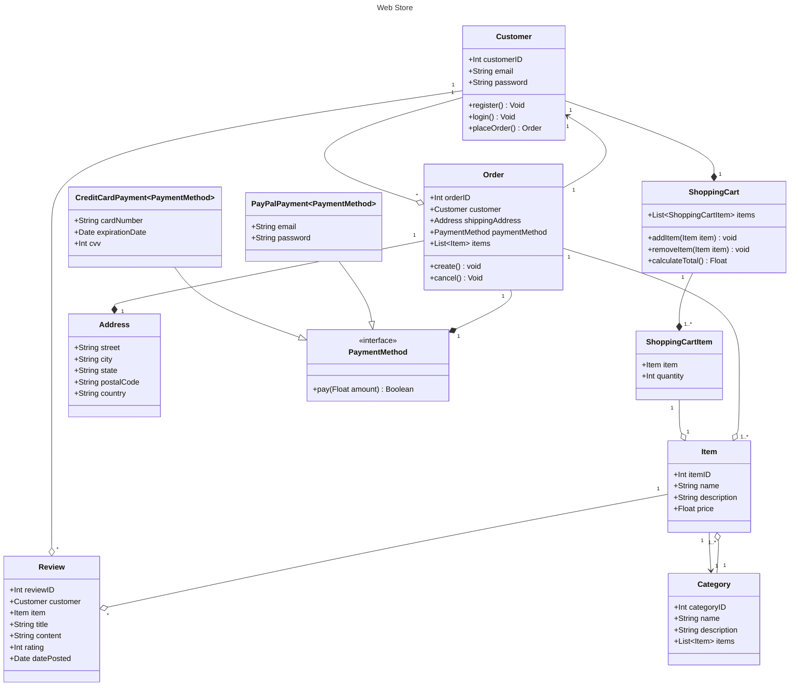
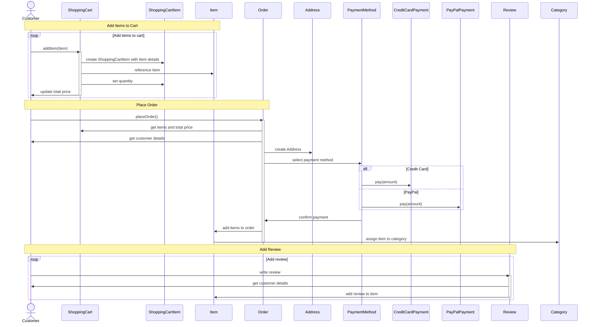
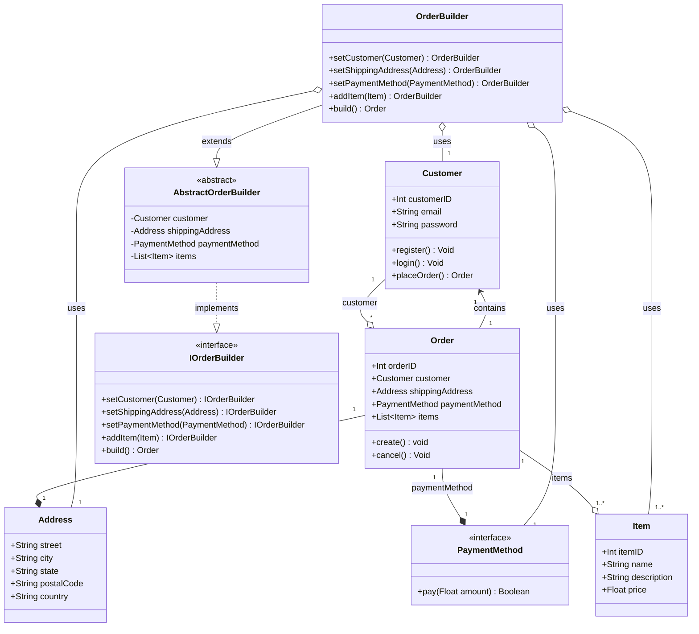
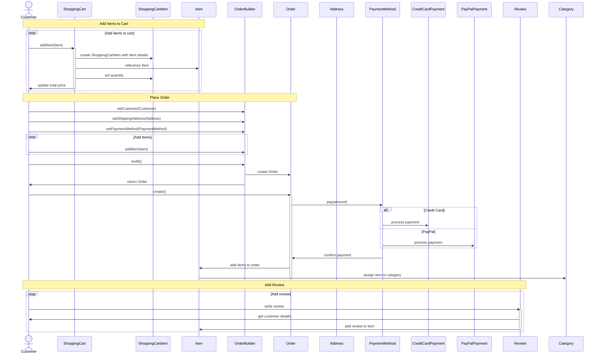

# design-patterns-studies

## Main diagram without patterns

### Class diagram

### Sequence diagram

## Builder pattern

W tym diagramie warto użyć wzorca **Budowniczy** (_Builder_) ze względu na złożoność obiektów, takich jak `Order`, które mają wiele atrybutów i zależności. 
Wzorzec **Builder** może pomóc w uporządkowaniu procesu tworzenia obiektów `Order` poprzez zapewnienie bardziej elastycznego i czytelnego podejścia do 
konstrukcji tych obiektów.

Oto kilka powodów, dla których warto użyć wzorca Builder w tym przypadku:
1. Łatwiejsza konstrukcja obiektów: **Budowniczy** pozwala na tworzenie obiektów krok po kroku, umożliwiając konstrukcję obiektów z różnymi kombinacjami atrybutów i zależnościami. 
   Dzięki temu można uniknąć zbyt skomplikowanych konstruktorów lub wielu konstruktorów z różnymi argumentami.
2. Oddzielenie logiki konstrukcji od reprezentacji: Wzorzec **Builder** oddziela proces tworzenia obiektów od ich reprezentacji. 
   Umożliwia to utrzymanie kodu bardziej przejrzystym i modularnym, ułatwiając jednocześnie utrzymanie i rozwój.
3. Łatwiejsza modyfikacja i rozbudowa: Jeśli chcemy dodać nowy atrybut lub zależność do klasy Order, wystarczy zmodyfikować odpowiednią metodę w Builderze, zamiast modyfikować wiele konstruktorów. Dzięki temu modyfikacje są łatwiejsze do zarządzania, a kod jest bardziej elastyczny.
4. Niezmienność obiektów: Wzorzec Builder może pomóc w utrzymaniu niezmienności obiektów, co jest szczególnie ważne w przypadku klas, które mają wiele atrybutów. Niezmienne obiekty są bezpieczniejsze i łatwiejsze w utrzymaniu, ponieważ ich stan nie może być zmieniony po utworzeniu.

W kontekście tego diagramu, warto zastosować wzorzec **Builder** w klasie `Order`, która ma wiele zależności, takich jak `Customer`, `Address`, `PaymentMethod` i `Item`. 
Implementacja Builder'a w klasie Order pozwoli na elastyczne tworzenie zamówień z różnymi kombinacjami atrybutów, jednocześnie utrzymując kod czytelnym i łatwym w utrzymaniu.

### Class diagram

> Wyłącznie modyfikowana część (nie cały diagram)

### Sequence diagram

