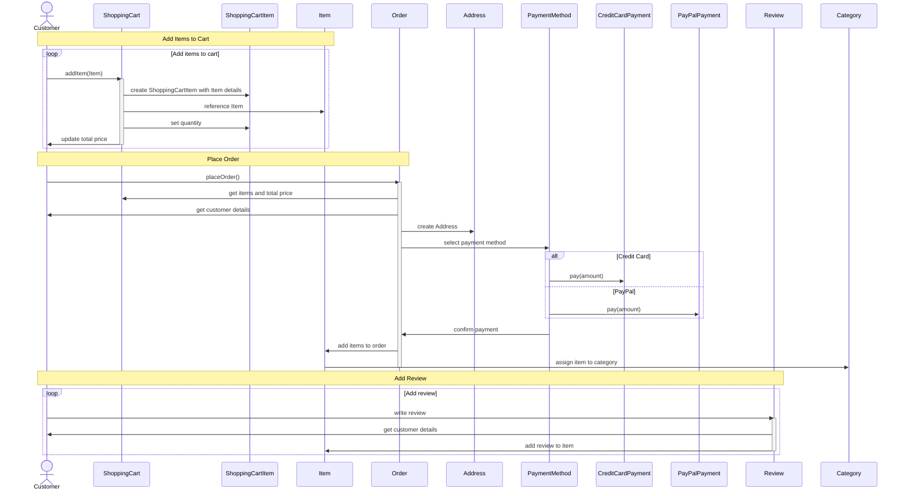

# design-patterns-studies

### TOC

 - [Creational Patterns](./CREATIONAL.md) 
 - [Structural Patterns](./STRUCTURAL.md)
 - [Behavioral Patterns](./BEHAVIORAL.md)

## Main diagram without patterns

### Class diagram

### Sequence diagram

