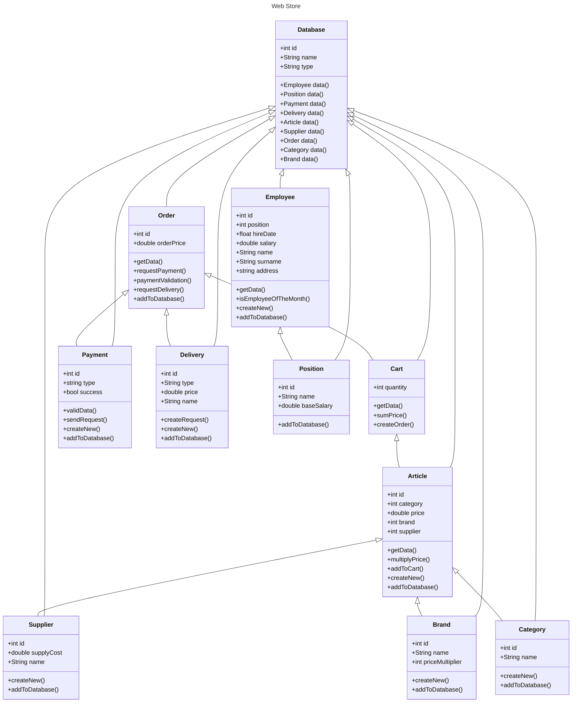

# design-patterns-studies

## Example diagram

```mermaid
---
title: Web Store
---

classDiagram
    
    Database <|-- Order
    Database <|-- Cart
    Database <|-- Payment
    Database <|-- Delivery
    Database <|-- Supplier 
    Database <|-- Article 
    Database <|-- Brand 
    Database <|-- Category 
    Database <|-- Employee 
    Database <|-- Position
    Order <|-- Delivery
    Order <|-- Cart
    Order <|-- Payment
    Employee <|-- Position
    Cart <|-- Article
    Article <|-- Brand
    Article <|-- Supplier
    Article <|-- Category
    
    class Article {
        +int id
        +int category
        +double price
        +int brand
        +int supplier
        +getData()
        +multiplyPrice()
        +addToCart()
        +createNew()
        +addToDatabase()
    }
    class Cart {
        +int quantity
        +getData()
        +sumPrice()
        +createOrder()
    }
    class Order {
        +int id
        +double orderPrice
        +getData()
        +requestPayment()
        +paymentValidation()
        +requestDelivery()
        +addToDatabase()
    }
    class Supplier {
        +int id
        +double supplyCost
        +String name
        +createNew()
        +addToDatabase()
    }
    class Brand {
        +int id
        +String name
        +int priceMultiplier
        +createNew()
        +addToDatabase()
    }
    class Category {
        +int id
        +String name
        +createNew()
        +addToDatabase()
    }
    class Payment {
        +int id
        +string type
        +bool success
        +validData()
        +sendRequest()
        +createNew()
        +addToDatabase()
    }
    class Delivery {
        +int id
        +String type
        +double price
        +String name
        +createRequest()
        +createNew()
        +addToDatabase()
    }
    class Employee {
        +int id
        +int position
        +float hireDate
        +double salary
        +String name
        +String surname
        +string address
        +getData()
        +isEmployeeOfTheMonth()
        +createNew()
        +addToDatabase()
    }
    class Position {
        +int id
        +String name
        +double baseSalary
        +addToDatabase()
    }
    class Database {
        +int id
        +String name
        +String type
        +Employee data()
        +Position data()
        +Payment data()
        +Delivery data()
        +Article data()
        +Supplier data()
        +Order data()
        +Category data()
        +Brand data()
    }
```
