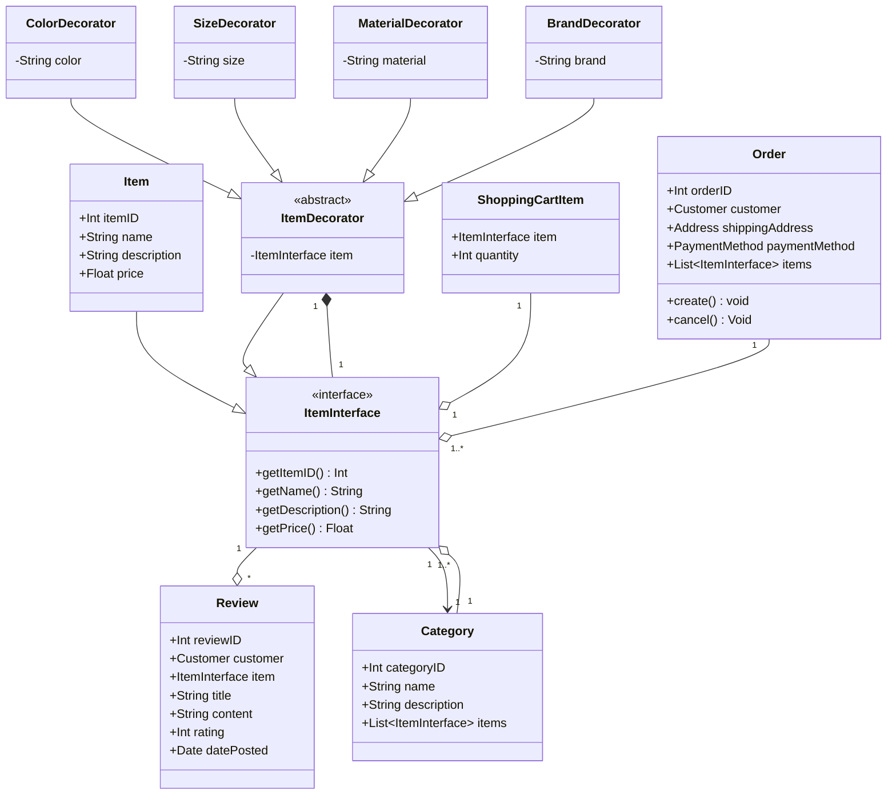
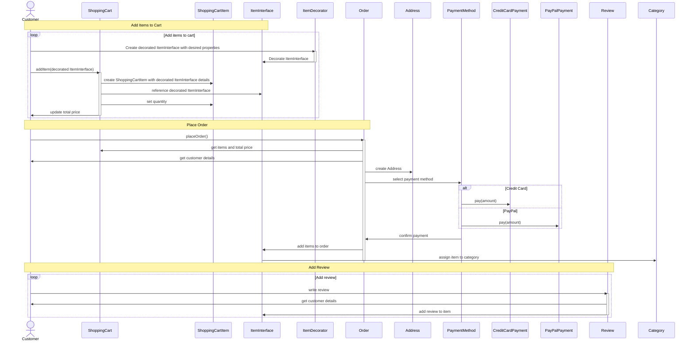
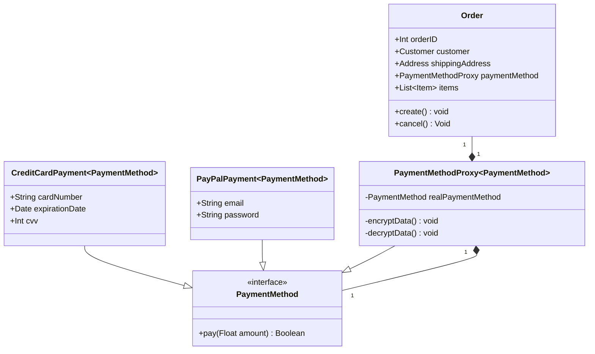
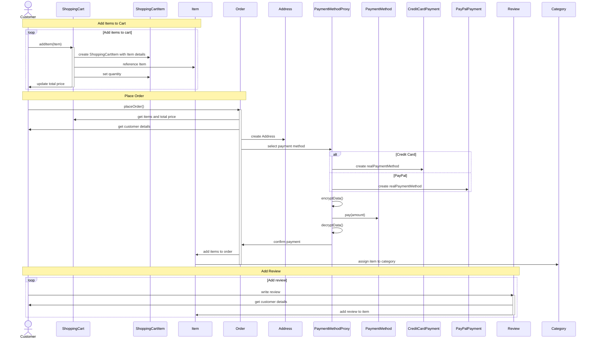

# Structural Patterns

## Decorator Pattern

Wzorzec dekorator został użyty w przypadku klasy "Item" 
w celu dynamicznego dodawania nowych właściwości (w tym przypadku: kolor, rozmiar, materiał i marka) 
do obiektów tej klasy bez konieczności modyfikowania jej kodu źródłowego. 
Wykorzystanie wzorca dekoratora przynosi wiele korzyści:
1. **Elastyczność**: Dekorator pozwala na dodawanie lub usuwanie nowych właściwości obiektów w czasie wykonywania programu, co daje dużą elastyczność w zarządzaniu obiektami. 
Zamiast tworzyć wiele różnych podklas dla różnych kombinacji właściwości, możemy korzystać z pojedynczej klasy bazowej "Item" i dekorować ją za pomocą konkretnych 
dekoratorów w miarę potrzeb.
2. Otwartość na rozszerzenia, zamknięcie na modyfikacje (zasada "**Open/Closed**"): 
Wzorzec dekorator pozwala na rozszerzanie funkcjonalności obiektów bez konieczności modyfikowania ich kodu źródłowego. 
Dzięki temu możemy dodawać nowe funkcje i właściwości bez ryzyka wprowadzenia błędów do istniejącego kodu.
3. Zachowanie **jednorodności** interfejsów: 
Dekorator umożliwia dodawanie nowych właściwości, jednocześnie utrzymując jednorodność interfejsów klas. 
Wszystkie dekorowane obiekty implementują ten sam interfejs ("ItemInterface"), co ułatwia ich użycie w różnych częściach systemu.
4. **Rozdzielenie obowiązków**: Wzorzec dekorator promuje rozdzielenie obowiązków, ponieważ każdy dekorator zajmuje się tylko jednym aspektem rozszerzenia 
funkcjonalności klasy. Ułatwia to zarządzanie kodem, ponieważ każda klasa dekoratora ma jedno konkretne zadanie.

W podanym przykładzie, zastosowanie wzorca dekoratora pozwala na łatwe dodawanie, usuwanie lub modyfikowanie właściwości obiektów klasy "Item" bez konieczności modyfikowania ich kodu źródłowego ani tworzenia licznych podklas.

### Class Diagram

### Sequence Diagram

W celu zaimplementowania wzorca dekoratora w diagramie sekwencji, wprowadziliśmy następujące zmiany:
1. Zamiast korzystać bezpośrednio z obiektów Item, teraz używamy obiektów `ItemInterface`, 
które mogą być dekorowane za pomocą konkretnych klas dekoratorów, takich jak `ColorDecorator`, `SizeDecorator`, `MaterialDecorator` i `BrandDecorator`. 
Wprowadzenie ItemInterface pozwala na dodanie nowych właściwości do obiektów Item bez modyfikowania ich kodu.
2. Przed dodaniem przedmiotów do koszyka, klient tworzy dekorowane obiekty ItemInterface za pomocą klas `ItemDecorator`. 
To umożliwia dodanie pożądanych właściwości do obiektów Item w elastyczny sposób, bez konieczności modyfikowania ich oryginalnych klas.
3. W momencie dodawania przedmiotów do koszyka, klient dodaje teraz dekorowane obiekty `ItemInterface` do koszyka. 
Pozwala to na przechowywanie dodatkowych właściwości związanych z przedmiotami w koszyku i ich uwzględnienie podczas składania zamówienia.
4. Diagram sekwencji uwzględnia teraz korzystanie z dekoratorów w kontekście dodawania przedmiotów do koszyka, składania zamówień i dodawania recenzji. Wszystkie te interakcje odnoszą się teraz do dekorowanych obiektów `ItemInterface`,
co pozwala na większą elastyczność i rozszerzalność systemu.

Wprowadzenie wzorca dekoratora w diagramie sekwencji pozwala na lepsze zarządzanie dodatkowymi właściwościami przedmiotów, bez konieczności modyfikowania istniejących klas. Daje to większą elastyczność i łatwiejsze utrzymanie kodu w przyszłości.

## Proxy Pattern

Wzorzec Proxy jest szczególnie przydatny, gdy chcemy kontrolować dostęp do oryginalnego obiektu oraz wykonywać dodatkowe operacje przed lub po przekazaniu wywołania do tego obiektu. 
W przypadku klasy PaymentMethod oraz jej implementacji (CreditCardPayment i PayPalPayment), zastosowanie wzorca Proxy może przynieść następujące korzyści:
1. **Logowanie informacji o płatnościach**: Wzorzec Proxy pozwala na rejestrowanie informacji o płatnościach, takich jak czas wykonania, status transakcji itp. 
Możemy zaimplementować logowanie w klasie PaymentMethodProxy, co pozwoli na rejestrację tych informacji dla wszystkich rodzajów płatności, niezależnie od ich konkretnej implementacji.
2. **Sprawdzanie uprawnień klienta**: Przed wykonaniem płatności, możemy sprawdzić, czy klient ma wystarczające środki na koncie lub czy jego dane do płatności są poprawne. 
Wzorzec Proxy pozwala na dodanie takich kontroli w jednym miejscu, bez zmiany oryginalnych klas płatności, takich jak CreditCardPayment i PayPalPayment.
3. **Zmiana implementacji płatności**: Wzorzec Proxy ułatwia również wprowadzenie zmian w implementacji płatności, na przykład dodanie nowych metod płatności, bez wpływu na pozostałe części systemu. 
Ponieważ klasa Order korzysta z interfejsu PaymentMethod, możemy łatwo dodać nową implementację płatności i połączyć ją z klasą PaymentMethodProxy.
4. **Ochrona wrażliwych danych**: Wzorzec Proxy może pomóc w ochronie wrażliwych danych klientów, takich jak numer karty kredytowej, poprzez dodanie warstwy bezpieczeństwa. 
Na przykład, klasa PaymentMethodProxy może szyfrować dane klienta przed przekazaniem ich do oryginalnego obiektu płatności oraz deszyfrować je po otrzymaniu odpowiedzi.

Podsumowując, zastosowanie wzorca Proxy dla klasy PaymentMethod pozwala na kontrolowanie dostępu do oryginalnego obiektu płatności, dodanie logowania, sprawdzanie uprawnień klienta, zmianę implementacji płatności oraz ochronę wrażliwych danych. 
Wszystko to przyczynia się do zwiększenia elastyczności i bezpieczeństwa systemu.

### Class Diagram

### Sequence Diagram

W diagramie sekwencji wprowadziliśmy następujące zmiany:
1. Zamiast korzystać bezpośrednio z obiektów `PaymentMethod` (takich jak `CreditCardPayment` i `PayPalPayment`), teraz używamy obiektów `PaymentMethodProxy`. 
Pozwala to na dodanie dodatkowej warstwy bezpieczeństwa, takiej jak szyfrowanie i deszyfrowanie danych, podczas przeprowadzania płatności.
2. W momencie wyboru metody płatności w klasie Order, tworzymy instancję klasy `PaymentMethodProxy` zamiast bezpośrednio tworzyć instancje `CreditCardPayment` lub `PayPalPayment`.
3. Przed przekazaniem płatności do rzeczywistego obiektu `PaymentMethod`, klasa `PaymentMethodProxy` szyfruje dane, a po zakończeniu płatności deszyfruje je. 
To dodaje dodatkową warstwę bezpieczeństwa do procesu płatności.

Wprowadzenie wzorca Proxy do diagramu sekwencji pozwala na lepsze zarządzanie bezpieczeństwem płatności, bez konieczności modyfikowania istniejących klas. 
To daje większą elastyczność i łatwiejsze utrzymanie kodu w przyszłości.

