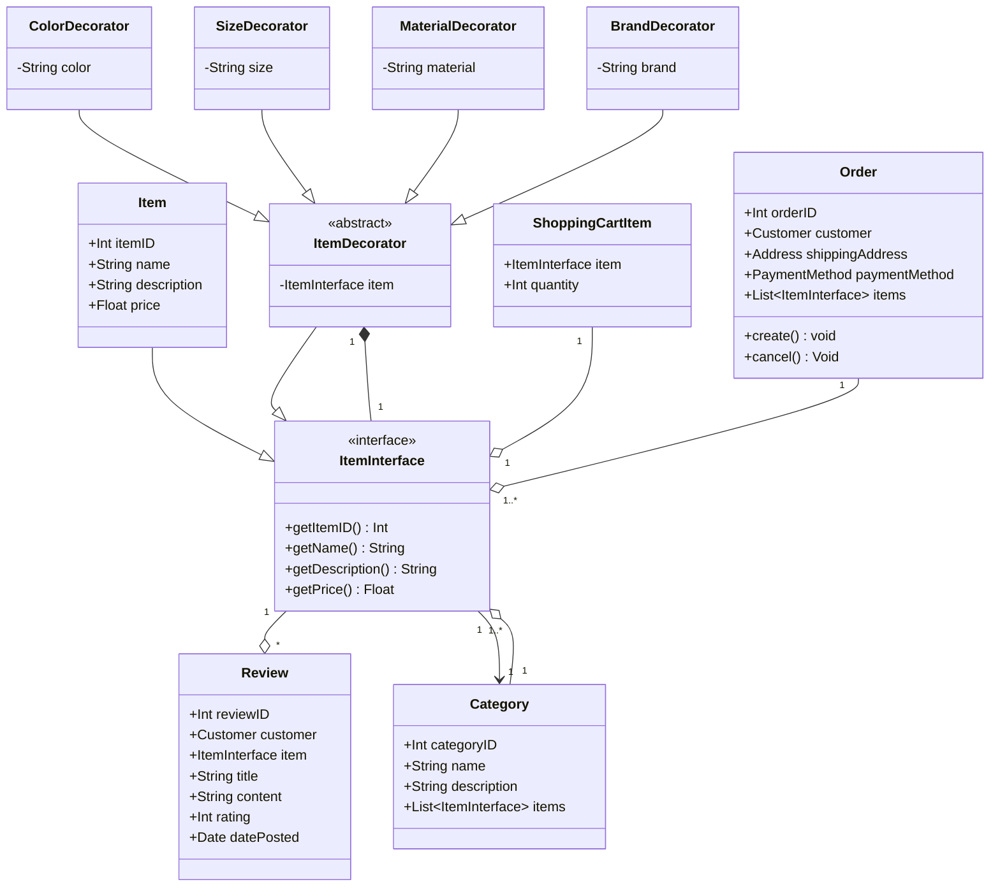
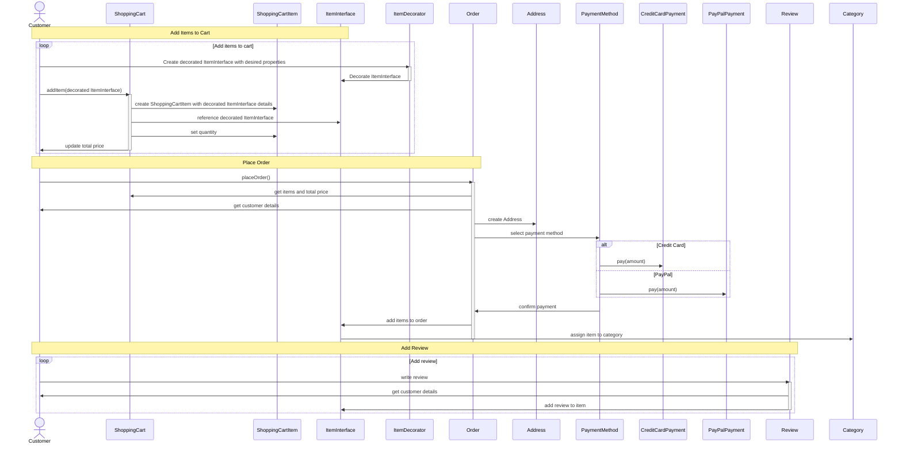

# Structural Patterns

## Decorator Pattern

Wzorzec dekorator został użyty w przypadku klasy "Item" 
w celu dynamicznego dodawania nowych właściwości (w tym przypadku: kolor, rozmiar, materiał i marka) 
do obiektów tej klasy bez konieczności modyfikowania jej kodu źródłowego. 
Wykorzystanie wzorca dekoratora przynosi wiele korzyści:
1. **Elastyczność**: Dekorator pozwala na dodawanie lub usuwanie nowych właściwości obiektów w czasie wykonywania programu, co daje dużą elastyczność w zarządzaniu obiektami. 
Zamiast tworzyć wiele różnych podklas dla różnych kombinacji właściwości, możemy korzystać z pojedynczej klasy bazowej "Item" i dekorować ją za pomocą konkretnych 
dekoratorów w miarę potrzeb.
2. Otwartość na rozszerzenia, zamknięcie na modyfikacje (zasada "**Open/Closed**"): 
Wzorzec dekorator pozwala na rozszerzanie funkcjonalności obiektów bez konieczności modyfikowania ich kodu źródłowego. 
Dzięki temu możemy dodawać nowe funkcje i właściwości bez ryzyka wprowadzenia błędów do istniejącego kodu.
3. Zachowanie **jednorodności** interfejsów: 
Dekorator umożliwia dodawanie nowych właściwości, jednocześnie utrzymując jednorodność interfejsów klas. 
Wszystkie dekorowane obiekty implementują ten sam interfejs ("ItemInterface"), co ułatwia ich użycie w różnych częściach systemu.
4. **Rozdzielenie obowiązków**: Wzorzec dekorator promuje rozdzielenie obowiązków, ponieważ każdy dekorator zajmuje się tylko jednym aspektem rozszerzenia 
funkcjonalności klasy. Ułatwia to zarządzanie kodem, ponieważ każda klasa dekoratora ma jedno konkretne zadanie.

W podanym przykładzie, zastosowanie wzorca dekoratora pozwala na łatwe dodawanie, usuwanie lub modyfikowanie właściwości obiektów klasy "Item" bez konieczności modyfikowania ich kodu źródłowego ani tworzenia licznych podklas.

### Class Diagram

### Sequence Diagram

W celu zaimplementowania wzorca dekoratora w diagramie sekwencji, wprowadziliśmy następujące zmiany:
1. Zamiast korzystać bezpośrednio z obiektów Item, teraz używamy obiektów `ItemInterface`, 
które mogą być dekorowane za pomocą konkretnych klas dekoratorów, takich jak `ColorDecorator`, `SizeDecorator`, `MaterialDecorator` i `BrandDecorator`. 
Wprowadzenie ItemInterface pozwala na dodanie nowych właściwości do obiektów Item bez modyfikowania ich kodu.
2. Przed dodaniem przedmiotów do koszyka, klient tworzy dekorowane obiekty ItemInterface za pomocą klas `ItemDecorator`. 
To umożliwia dodanie pożądanych właściwości do obiektów Item w elastyczny sposób, bez konieczności modyfikowania ich oryginalnych klas.
3. W momencie dodawania przedmiotów do koszyka, klient dodaje teraz dekorowane obiekty `ItemInterface` do koszyka. 
Pozwala to na przechowywanie dodatkowych właściwości związanych z przedmiotami w koszyku i ich uwzględnienie podczas składania zamówienia.
4. Diagram sekwencji uwzględnia teraz korzystanie z dekoratorów w kontekście dodawania przedmiotów do koszyka, składania zamówień i dodawania recenzji. Wszystkie te interakcje odnoszą się teraz do dekorowanych obiektów `ItemInterface`,
co pozwala na większą elastyczność i rozszerzalność systemu.

Wprowadzenie wzorca dekoratora w diagramie sekwencji pozwala na lepsze zarządzanie dodatkowymi właściwościami przedmiotów, bez konieczności modyfikowania istniejących klas. Daje to większą elastyczność i łatwiejsze utrzymanie kodu w przyszłości.

